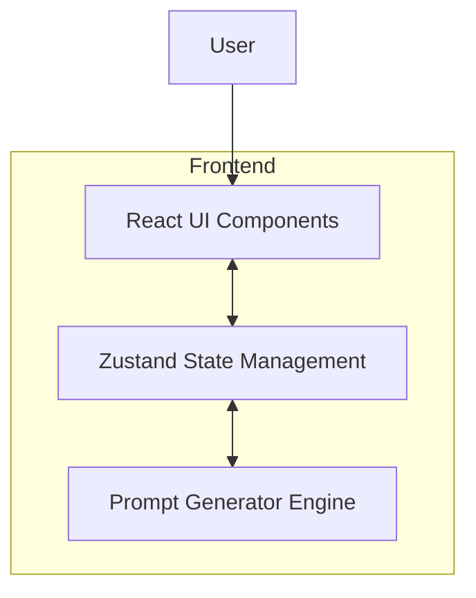

## 1. 架构设计


## 2. 技术说明
- **前端框架**: React@18 + Vite
- **样式方案**: Tailwind CSS@3
- **状态管理**: Zustand (用于跨步骤保存用户选择的提示词参数)
- **图标库**: lucide-react
- **初始化工具**: vite-init (使用 react-ts 模板)

## 3. 路由定义
| 路由 | 页面组件 | 用途 |
|-------|---------|---------|
| `/` | `Home` | 首页展示与入口 |
| `/wizard` | `Wizard` | 步骤化收集用户输入 |
| `/result` | `Result` | 提示词生成与展示 |

## 4. 数据模型 (前端状态)
使用 Zustand 管理用户的输入数据，结构如下：
```typescript
interface PromptState {
  subject: string; // 画面主体描述
  style: string;   // 艺术风格 (例如: Cyberpunk, Watercolor)
  lighting: string; // 光影效果 (例如: Cinematic lighting, Studio lighting)
  camera: string;   // 镜头视角 (例如: Close-up, Wide angle)
  quality: string;  // 画质增强词 (例如: 8k resolution, masterpiece, highly detailed)
  setField: (field: keyof PromptState, value: string) => void;
  reset: () => void;
}
```

## 5. 提示词拼接引擎
在前端实现一个轻量级的逻辑模块，将结构化的选择转化为大模型易于理解的英文/中文提示词模板。
**基础拼接逻辑示例**：
`{subject}, in {style} style, {lighting}, {camera}, {quality}`
*(将根据用户的具体选择进行智能过滤和格式化处理)*