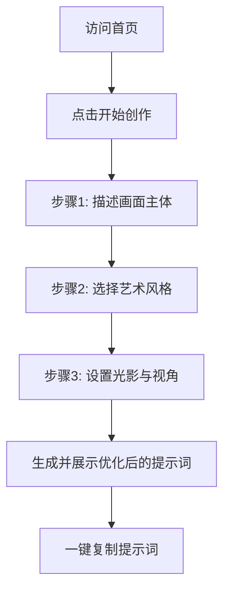

## 1. 产品概述
本项目旨在解决用户在使用大模型（如豆包、元宝、Midjourney等）进行图像生成时，无法提供准确、专业提示词（Prompt）的痛点。
产品将通过分步引导的方式，根据用户的简单描述，智能拼接并优化出最佳的生图提示词，并提供一键复制功能。

## 2. 核心功能

### 2.1 功能模块
1. **首页 (Home)**：产品介绍（Hero Section），提供“开始创作”入口。
2. **生成向导页 (Wizard)**：分步骤的表单交互。包括：主体描述（画面主要内容）、艺术风格（如赛博朋克、水彩、写实等）、环境与光影、镜头视角等。
3. **结果展示页 (Result)**：展示最终生成的高质量提示词（包含中文解析与英文原词），提供一键复制功能，以及推荐使用的AI生图工具快捷链接。

### 2.2 页面详情
| 页面名称 | 模块名称 | 功能描述 |
|-----------|-------------|---------------------|
| 首页 | 英雄区 (Hero) | 展示产品标语、特色介绍及主视觉动画，引导用户点击开始。 |
| 向导页 | 步骤指示器 | 显示当前所处步骤（如 1/4 等）。 |
| 向导页 | 动态表单 | 提供文本输入与精美卡片式单选/多选框（风格、光影等）。 |
| 结果页 | 提示词展示区 | 呈现优化后的结构化提示词，支持一键复制。 |

## 3. 核心流程
用户进入应用首页 -> 点击“开始生成” -> 进入向导第一步（输入画面主体） -> 第二步（选择艺术风格） -> 第三步（选择光影与镜头） -> 第四步（选择画质与细节） -> 系统自动生成并展示最佳提示词 -> 用户一键复制并前往生图工具。

## 4. 用户界面设计
### 4.1 设计风格
- **主色调与氛围**：采用现代科技感的“暗黑模式”（Dark Mode），背景以深灰/黑色为主，搭配霓虹紫（Neon Purple）或电光蓝（Electric Blue）作为强调色。
- **组件样式**：使用毛玻璃效果（Glassmorphism）、大圆角、微渐变边框，营造精致的AI工具氛围。
- **字体**：使用无衬线字体（如 Inter 或系统默认的现代中文字体），标题采用加粗且带有渐变色填充的设计。
- **动画**：页面切换和步骤过渡使用平滑的淡入淡出（Fade-in）和位移动画。

### 4.2 页面设计概述
| 页面名称 | 模块名称 | UI 元素 |
|-----------|-------------|-------------|
| 首页 | 英雄区 | 渐变大标题、发光按钮、悬浮的装饰性图形 |
| 向导页 | 选项卡片 | 带有图标的选项卡片，Hover时边框发光并有轻微放大效果 |
| 结果页 | 结果面板 | 类似终端或代码块的深色背景面板，带有明显的“复制”操作按钮 |

### 4.3 响应式
桌面端优先（Desktop-first），完美适配移动端浏览，确保表单与卡片在小屏幕上能够优雅折叠。